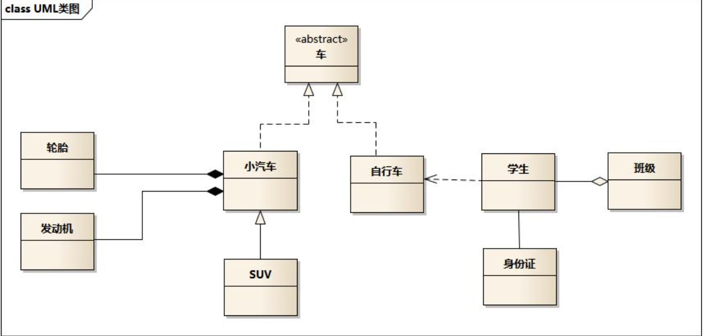
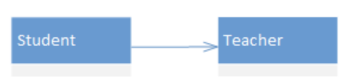
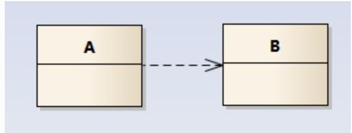
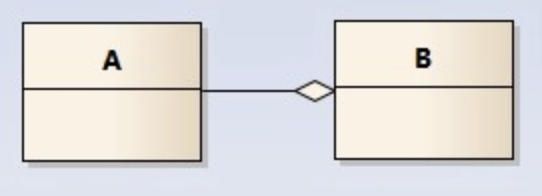
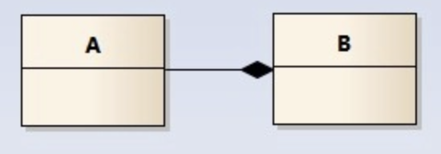
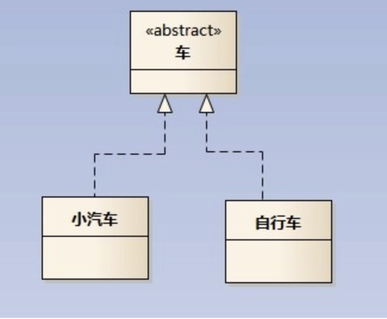
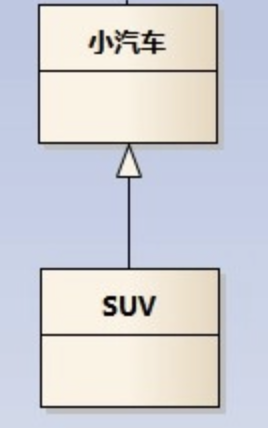

# System Design Knowledge Sharing

Everything we need to know about system design. Codes are mostly in C++.  

Powered by ChatGPT4. >w<

# DDIA

## Unified Modeling Language (UML)

UML is a standardized modeling language that is used to visualize the design of a system. It is commonly used in software engineering. 

### Class Name（类名）, Field（属性）, Methods（方法）

If something is *Italic*, it means that the thing is abstract, or is an interface. Also, 

- "+" means `public`；
- "-" means `private`；
- "#" means `protected`；
- no sign means `default`。

### Relationships

#### Association(关联)

#### Dependency（依赖）

#### Aggregation（聚合）

#### Composition（组合）

A special aggregation relationship of strong dependence. If B does not exist, the part does not exist. For example, the company does not exist, and the department will also cease to exist;

#### Realization（实现）

Inherit abstract class.

#### Generalization（泛化）

Inherit non-abstract class.

## Design Patterns

[`visitor`](docs/visitor.md)

[`observer`](docs/observer.md)

[`iterator`](docs/iterator.md)

[`composite`](docs/composite.md)

[`adapter`](docs/adapter.md)

[`command`](docs/command.md)

[`decorator`](docs/decorator.md)

[`strategy`](docs/strategy.md)

[`singleton`](docs/singleton.md)

[`test driven development(TDD)`](docs/tdd.md)

[`factory`](docs/factory.md)

[`cohesion & coupling`](docs/cohesion&coupling.md)

## How to handle real-life questions

https://www.educative.io/courses/grokking-modern-system-design-interview-for-engineers-managers/xVXol171Ex9
* **understand** the design problem and its requirements(functional & nonfunctional ).
* **handle data** (size, grow rate, usage, read/write heavy, consistency, privacy, etc)
* **components**
* **tradeoffs**

## Resources

https://www.educative.io/courses/grokking-the-system-design-interview ( best for junior)

https://bestresources.co/resource/best-handpicked-system-design-interesting-reads-qvbimi

## Reference

https://www.ibm.com/docs/en/rsar/9.5

https://zhuanlan.zhihu.com/p/109655171

https://design-patterns.readthedocs.io/zh_CN/latest/read_uml.html
