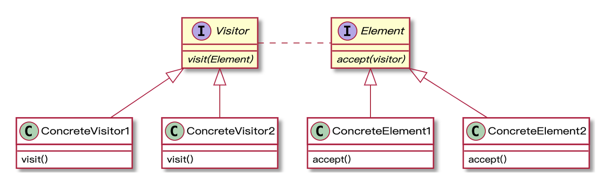

# visitor

The Visitor pattern is a behavioral design pattern that allows you to separate algorithms from the objects on which they operate. It also allows you to add new operations to existing object structures without modifying those structures. It's useful when you need to perform various operations on a set of objects with different classes, and you want to avoid "polluting" their classes with these operations.

Here's a simple example to illustrate the Visitor pattern:

Let's say we have a structure representing a computer system. The structure includes several different types of elements: a Computer, a Monitor, a Keyboard, and a Mouse.

First, we define an interface for the visitor:

```java
public interface ComputerPartVisitor {
    public void visit(Computer computer);
    public void visit(Mouse mouse);
    public void visit(Keyboard keyboard);
    public void visit(Monitor monitor);
}
```

Then, we define an interface for the parts that can be visited:

```java
public interface ComputerPart {
    public void accept(ComputerPartVisitor computerPartVisitor);
}
```

Each part implements the `ComputerPart` interface:

```java
public class Keyboard implements ComputerPart {
    @Override
    public void accept(ComputerPartVisitor computerPartVisitor) {
        computerPartVisitor.visit(this);
    }
}

// Similar classes for Mouse, Monitor, and Computer
```

The `Computer` class, which represents the entire system, would contain a collection of `ComputerPart` objects and implement the `accept` method such that it calls the `accept` method on each of these objects:

```java
public class Computer implements ComputerPart {
    ComputerPart[] parts;

    public Computer(){
        parts = new ComputerPart[] {new Mouse(), new Keyboard(), new Monitor()}; 
    } 

    @Override
    public void accept(ComputerPartVisitor computerPartVisitor) {
        for (int i = 0; i < parts.length; i++) {
            parts[i].accept(computerPartVisitor);
        }
        computerPartVisitor.visit(this);
    }
}
```

Finally, we implement the `ComputerPartVisitor` interface. This is where we define the operations we want to perform:

```java
public class ComputerPartDisplayVisitor implements ComputerPartVisitor {
    @Override
    public void visit(Computer computer) {
        System.out.println("Displaying Computer.");
    }

    @Override
    public void visit(Mouse mouse) {
        System.out.println("Displaying Mouse.");
    }

    @Override
    public void visit(Keyboard keyboard) {
        System.out.println("Displaying Keyboard.");
    }

    @Override
    public void visit(Monitor monitor) {
        System.out.println("Displaying Monitor.");
    }
}
```

To use the visitor, we would do something like this:

```java
public class Demo {
    public static void main(String[] args) {
        ComputerPart computer = new Computer();
        computer.accept(new ComputerPartDisplayVisitor());
    }
}
```

This will output:

```
Displaying Mouse.
Displaying Keyboard.
Displaying Monitor.
Displaying Computer.
```

In this example, the `ComputerPartDisplayVisitor` is able to perform operations on `ComputerPart` objects without those objects needing to have those operations defined in their own classes. This is the essence of the Visitor pattern.

